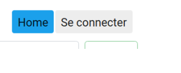

# CSS et animation

## Exercice 1

Faites des styles CSS pour les éléments HTML de navigation, utilisez la directive
routerLinkActive pour définir une classe lorsque le lien est dans l’état “active”.

Vous devez arriver à un rendu équivalent à celui proposé dans la figure suivante :




Utilisez la syntaxe SCSS pour réaliser cette partie.

## Module animation Angular

Angular possède des modules d’animation automatiquement installé lors de la
création d’un nouveau projet Angular :

```angularjs
@angular/animations 
//and 
@angular/platform-browser
```

Le système d’animation d’Angular repose sur les fonctionnalités du CSS, ce
qui signifie que vous pouvez animer toute propriété que le navigateur considère
comme potentiellement “animable” : positions, tailles, transformations CSS,
transition CSS, couleurs, etc.

Pour pouvoir les utiliser dans l’application vous devez les importer dans le
AppModule :

```angularjs
import { BrowserAnimationsModule } from '@angular/platform-browser/animations';
```

Puis vous devez dans le component que vous souhaitez animer importer les
fonctions d’animation :

```angularjs
import {
    trigger,
    state,
    style,
    animate,
    transition,
    // ...
} from '@angular/animations';
```

Dans le décorateur @Component vous devez définir l’animation :

```angularjs
@Component({
    selector: 'app-root',
    templateUrl: 'app.component.html',
    styleUrls: ['app.component.scss'],
    animations: [
        // animation triggers ...
    ]
})
```

### state et style

Angular utilise la fonction state pour définir les différents états des transitions.
Cette fonction prend deux arguments : un attribut et la fonction style qui
définira le style CSS (écrivez vos CSS en camelCase) :

```angularjs
// définir l'état open de l'élément HTML
state('open', style({
    height: '100px',
    opacity: 1,
    backgroundColor: 'green'
})),
    
// définir l'état close de l'élément HTML
state('close', style({
    height: '100px',
    opacity: 0.25,
    backgroundColor: 'yellow'
})),
```

### animate

La fonction animate() définit le délais et le “easing of transition” :

animate (‘duration delay easing’)

- duration and delay : 0.2s 100ms : attendre 100ms et faire l’animation en
  200ms
- easing définit la manière dont l’animation doit se produire ([easing]:
  https://material.io/design/motion/speed.html#easing )

```angularjs
// On peut définir une transition entre deux états de la manière suivante :
transition('open => close', [
    animate('2s')
]),
```

Remarques : state() définit les styles qui seront appliqués à la fin de chaque transition. 
Ils persisteront lorsque l’animation sera terminée. 
La fonction transition() définira les styles intermédiaires pendant l’animation. Si une animation est dans
un état inactif les styles sont ignorés, mais pas les styles de la fonction state().

### trigger

Une animation nécessite un trigger pour savoir quand celle-ci commence et se
termine et pour définir un nom à l’animation :

```angularjs
animations: [
  trigger('myAnimation', [
    // vos states et animations
  ]),
],
```

Dans le template vous écrirez, pour cibler l’élément sur lequel vous souhaitez
réaliser l’animation, la syntaxe suivante : [@triggerName]=“expression”

```angular2html
<div [@myAnimation]="isActive ? 'open' : 'close'">
    <p>...</p>
</div>
```

## Exercice 2

Une animation, nous le rappelons, nécessite un trigger. Elle permet de collecter
les états de transitions et donne un nom à l’animation ce nom permet de lier
l’animation à un élément HTML du template.

Précisons pour les transitions les différents états sont au nombre de 4 :

open => closed

// passe de l'état open à autre chose
open => "state"
"state" => closed

// capture n'importe quel état entre deux changements
"state1" => "state2"

// supprimer ou pas encore attaché à la vue vers un autre état void est identique à "state"
void => "state"

Notez qu’il y a trois propriétés de synchronisation que vous pouvez accorder
pour chaque transition animée : la durée (200, 200ms 0.2s), le délai et la fonction
d’accélération.

Rappelons que la durée contrôle le temps entre le début et la fin de l’animation.
Que le délai contrôle la durée entre le déclenchement de l’animation et le début
de la transition. L’accélération contrôle la manière dont l’animation accélère.

Créez une animation lorsqu’on affiche le détail d’une pâtisserie de votre choix avec
ce que vous avez vu en cours, par exemple changez la couleur du background
de l’élément HTML, mais vous êtes libre d’expérimenter d’autres effets lors de
cette animation. Aidez de la documentation Angular sur l’animation.